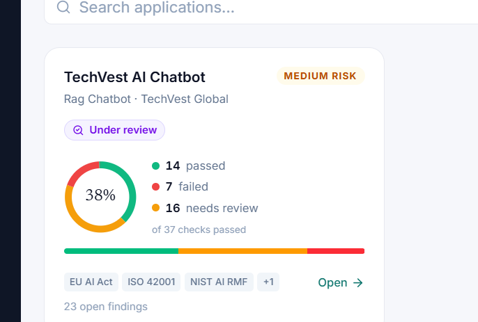

# GovernAI — Auditor Side Master Specification

> Scope: the **auditor (client-facing) side only**. Read-only. Every value shown is produced by the developer/engine side; this UI is a presentation/projection layer. Shared role-based auth already exists — never modify auth, the developer side, or shared components. This document is the authoritative reference for building and refining the auditor experience.

---

## 1. Product concept

GovernAI is an **enterprise standard for agentic AI governance**. It governs every kind of AI application in an organization — finance assistants, HR screeners, RAG assistants, autonomous agents — against **one control set**.

- **Our control set is the spine.** 10 governance dimensions and 44 metrics (CM-001…CM-044), including first-class **agentic controls** (tool-use authorization, action blast-radius, autonomy tiers, reversibility, human-in-command, escalation).
- **External frameworks are lenses, not the definition.** ISO 42001, NIST AI RMF, EU AI Act, OECD AI Principles are reference frameworks our controls **map to**. We show conformance in each framework's language; we are not defined by any one of them.
- **Control profile flexes by application type.** A finance agent, HR screener, RAG assistant, and autonomous agent each get a different applicable subset and thresholds of our controls. This mapping is defined on the developer side (Metrics Configuration) and **read** by the auditor UI.

The auditor is a **non-technical compliance stakeholder** who owns/oversees multiple AI applications. They come to: see each app's assurance status, understand *why* an app is or isn't compliant, view conformance per framework, read/export signed reports, and (read-only) request things from the developer. They never configure, never run, never edit.

---

## 2. Four-layer data model (what every screen is a view onto)

1. **Control set (spine):** dimensions → metrics. Each metric has: id, name, dimension, primary tool, applicable modalities, formula/how-to, practical gate/threshold, framework crosswalk, evidence-saved list. (Source: Metrics Configuration.)
2. **Application profile:** each app has type (finance/HR/RAG/agent), risk tier, modalities. Profile determines which controls/metrics **apply** and at what threshold. (Source: Metrics Configuration / Context Profiles.)
3. **Framework projection:** our controls mapped onto ISO/NIST/EU/OECD **controls**. Each framework has its controls; each control maps to our metrics; each control has requirement text, evidence requirements, applicability. (Source: Framework Mapping.)
4. **Evidence & verdict:** per-metric run results (score, threshold, status) → roll up to controls → roll up to dimensions and framework conformance → overall verdict. Evidence artifacts are sealed. (Source: engine run output.)

### Status vocabulary (precise — never conflate)
- **Metric result:** `passed` (normalized_score ≥ threshold) · `warning` (borderline / needs review) · `failed` · `manual review` · `not applicable` (metric doesn't apply to this app by modality/profile).
- **Control evidence type (critical for honesty):**
  - **Automated** — backed by our metrics; shows pass/fail from results.
  - **Manual / documentary** — the framework requires it but no runtime metric can evidence it (e.g. ISO A.2 AI policy, A.3 roles, A.5 impact-assessment process, A.10 suppliers). Shown as **"Requires manual evidence — not assessed by automated metrics."** Never auto-green, never metric-red.
  - **Not applicable** — out of scope for this app per its profile / Statement of Applicability.
- **Verdict (app or framework level):** `Compliant` · `Conditional` · `Not compliant` · **`Under review`** (engine returned blocked / human_review / insufficient evidence — a neutral state, NOT red "Not compliant"). Never invent a conformance percentage.

> **Honesty rule (non-negotiable for a compliance tool):** never imply coverage that doesn't exist. A control with no automated metric must read as "manual evidence required," not blank and not passing. Distinguish "failed a requirement" from "assessment couldn't decide" from "not measured by us."

---

## 3. Navigation architecture & flow (as-built)

> **This section documents the architecture as actually implemented, not an idealized target.** The auditor surface diverged from the original draft as it was built against real engine data; the sections below are the authoritative description of what exists. All auditor screens live under `frontend/src/pages/auditor/`, are driven by the `auditor` persona's nav in `frontend/src/data/mockData.ts`, and route through `useAppStore`.

```
Sidebar (auditor persona) — 3 visible items across 2 named sections
├── My Workspace
│    └── Applications      /applications    → Applications.tsx       (home / portfolio)
└── Compliance & Reporting
     ├── Compliance        /compliance      → Compliance.tsx         (per-app, controls-first)
     └── Reports           /client-reports  → ClientReports.tsx      (split list + inline preview)

Reachable, not in the rail (hidden nav entries):
   • Application record     /application     → ApplicationRecord.tsx  (opened from a card)
   • Activity ledger        /audit-ledger    → AuditLedger            (demoted; linked from a report)

FLOW:
Applications (verdict-first cards, posture strip, filters)
   └─ open card → useSelectionStore.selectedSystemId set → navigate /application
        APPLICATION RECORD — 5 tabs: Summary · Compliance · Metrics · Evidence · History
        │
        ├─ Summary     verdict-first stat tiles + "what this means" (plain language)
        ├─ Compliance  <ComplianceControls> — framework tab-strip, controls-first (shared)
        ├─ Metrics     engine checks grouped by normalized dimension → definition-first detail drawer
        ├─ Evidence    sealed artifacts, read-only expand
        └─ History     this app's run history (verdict + engine status + timestamp)

Compliance (sidebar) → same <ComplianceControls> component, per application
   • single app opens straight in; app-switcher pills appear only when >1 app
Reports (sidebar) → report list (one per app = latest run with a verdict) + inline ReportPreview

Actions (read-only role):
   • Request re-assessment — currently DISABLED (no backend request endpoint)
   • Request from developer — structured, per-control, inside ComplianceControls
   • Export / Download report — client-side JSON download
```

**Honest notes on the current state (the architecture is mid-consolidation):**
- **Compliance is one shared component.** Both the sidebar Compliance page and the Application-record Compliance tab render `ComplianceControls` (framework tab-strip → controls grouped by objective → expand for requirement/evidence/mapped metrics). The earlier framework×app **matrix** for the top-level Compliance page was retired; its helpers (`MatrixStatus`, `matrixMeta`, `rollUpControlStatuses` in `clientComponents.tsx`) remain exported but are no longer used by a live screen.
- **`FrameworkExplorer.tsx` is superseded.** The older framework-picker-grid → clause flow it implemented was replaced by `ComplianceControls`; it now survives only as an orphaned file (referenced in comments, not rendered). Treat `ComplianceControls` as the single source of truth for the clause view.
- **Retired reviewer pages remain in the repo but are not in the nav:** `AuditorOverview`, `ReviewQueue`, `Remediation`, `VerdictReview`, `AuditorSystems`, `MyAssignments`, `NotesQueries`. They are not part of the client-facing auditor surface.
- **History** is a fifth tab beyond the original four-tab record.
- **No hardcoded "44 metrics."** The Metrics view rolls up whatever checks the run produced, grouped by a *normalized* dimension label (`humanizeDimension` collapses mixed backend taxonomies) — fully dynamic.

Rationale: sidebar = portfolio-level destinations (Applications / Compliance / Reports); tabs = facets of one application. Compliance is a shared component reused at both the portfolio (per-app) and record level so the clause view is identical wherever the auditor lands.

---

## 4. Screen specifications (as-built)

### 4.1 Applications (home) — `Applications.tsx`
- Deduplicated list, **one entry per AI system** (source: `useAuditorWorkspace`). The displayed verdict comes from the latest run that produced a *verdict* (not merely `report_ready`) — real runs hang at `council_running` with a verdict before flipping status.
- **Posture strip:** 5 `StatTile`s — Applications assessed (n/total) · Compliant · Conditional · Not compliant · Under review.
- **Filter bar:** search + Verdict / Risk / Framework selects.
- **Card (`ApplicationCard`):** icon, name, `VerdictPill` (tier-first), system type, `RiskDot`, open-findings count, framework chips (first 4 + overflow), "Open →". No donut, no conformance %.
- Open → sets `useSelectionStore.selectedSystemId` and navigates to `/application`.

### 4.2 Application record — `ApplicationRecord.tsx`
- **Header:** back-to-Applications link, name, `VerdictPill` (tier-first via `verdictToClient`), `RiskDot`, `system_type` · owner · last-assessed (`timeAgo`). Suppresses the global page header while mounted.
- **Footer actions:** `Request re-assessment` (DISABLED, titled with the reason — no backend endpoint), `Export report` (client-side JSON blob download).
- **Not-assessed state** shown when the app has no verdict-bearing run.
- **Tabs** (`Tabs` component): **Summary · Compliance · Metrics · Evidence · History**; default **Summary**. Data from `useAuditorApplication(appId)` (+ `useComplianceMatrix` for the Compliance tab).

**Summary tab:** 4 `StatTile`s (Overall verdict / Metrics passed n·total / Dimensions assessed / Last assessed) + a "What this means" plain-language paragraph (verdict-aware, incl. Under-review wording that states both real gaps and the unresolved verdict) + optional `verdict.synthesis`.

**Compliance tab:** renders `<ComplianceControls frameworks={system.selected_frameworks} controlsFor={fw => matrix.cell(fw, appId).controls} />`. See §4.5.

**Metrics tab:** `StatTile`s (Assessed this run n[/planned] / Passed / Failed / Needs review). Checks grouped by **normalized dimension label** (`humanizeDimension` collapses mixed backend taxonomies), worst dimension first. Expand a `DimensionRow` → per-check rows (name + id, outcome chip, score/threshold, framework chips, evidence count). Select a check → right-side `MetricDetailDrawer` rendering `MetricDetailSections` (definition-first: what it means → this run's result → pass threshold → how it's measured → framework crosswalk → evidence → muted technical line) plus normalized/threshold/raw stats and linked evidence ids. Sections backed only by placeholder data hide themselves (no fabrication — honesty rule §2).

**Evidence tab:** count + sealed-artifact list; each row expands to source type / tool / score / trace id. Read-only.

**History tab:** most-recent ≤30 runs for this app (`listEvaluationRuns` filtered by `ai_system_id`, newest first). Each `HistoryRow`: absolute date+time (locale title) · relative time · "Current" chip on the assessed run · tier-first `VerdictPill` (per-run `getRunVerdict`) · engine-status pill (Completed / Failed / Cancelled / Running). Verdict + status + timestamp only.

### 4.3 Compliance (sidebar) — `Compliance.tsx`
- **Per-application** controls view (the framework×app matrix was retired). Page header + app-switcher pills **only when >1 app**; single-app orgs open straight into the controls.
- Body is the shared `<ComplianceControls>` for the selected app (§4.5), keyed by appId. Data from `useComplianceMatrix`.

### 4.4 Reports — `ClientReports.tsx`
- **Split view:** report list (left) + inline `ReportPreview` (right). One report per application = its latest run that produced a verdict; in-progress apps noted separately. Reading never requires a download.
- **Preview:** "Assurance report" kicker, system name, generated-time + framework list, `VerdictPill`, Download (JSON); 4 `StatTile`s (Verdict / Metrics passed / Dimensions / Open findings); Executive summary (`verdict.synthesis` or generated); Dimensions-assessed chips; **Framework mapping & checks** (`FrameworkMappingPreview`: clauses grouped by framework → per-clause status + mapped metric results with score/threshold); Key findings (top 5 open by severity, with remediation); footer link to the activity ledger for that run.

### 4.5 ComplianceControls (shared controls-first component) — `ComplianceControls.tsx`
- Used by **both** the §4.2 Compliance tab and the §4.3 Compliance page, so the clause view is identical everywhere. Props: `frameworks: string[]`, `controlsFor(fw) => FrameworkControlAssessment[]`, optional `onRequest`.
- **Framework tab-strip** (arrow-key navigable) with a per-framework badge: red count of not-satisfied controls / "ok" / "—" when none assessed. Defaults to the first framework with a not-satisfied control.
- **Blocking banner** (red) naming the first not-satisfied control, or a green "no blocking controls" line.
- **Coverage summary:** "N controls applicable · X automated · Y manual".
- **Filter pills:** All / Not satisfied / Partial / Satisfied / Manual / Not applicable (with counts).
- Controls **grouped by objective** (`control_category`), sorted worst-first. Each `ControlRow`: control_ref + title, per-metric passed/failed/pending line (automated), `EvidenceTypeBadge` (Automated / Manual / NA), `ControlStatusPill`. Expand → requirement text, evidence required, mapped metric results (or "requires manual/documentary evidence — not assessed by automated metrics"), and a **Request from developer** action (§5).
- In-UI honesty note: only controls with automated metric coverage are shown; manual/documentary controls will appear (labelled "manual evidence required") once the developer side adds them.

### 4.6 Shared building blocks
- **Component library — `clientComponents.tsx`:** `verdictToClient` (tier-first: `human_review` → neutral "Under review", never red), `VerdictPill`, `RiskDot`, `StatTile`, `Tabs`, `metricOutcome`/`metricPassed`/`metricFailed`/`metricOutcomeMeta`, `humanizeDimension`, `frameworkLabel`, `EvidenceTypeBadge`, `ControlStatusPill`, `controlEvidenceType`, `controlStatusFrom`. *(Legacy matrix helpers `matrixMeta`/`rollUpControlStatuses` remain exported but unused.)*
- **Metric detail — `MetricDetail.tsx`:** `MetricDetailSections`, the shared definition-first renderer.
- **Shared UI states — `components.tsx`:** `AuditorPageHeader`, `AuditorSkeleton`, `BackendError`, `SeverityTag`, `timeAgo`.
- **Hooks:** `useAuditorWorkspace` (portfolio: `systemsInScope` + `reviewItems`), `useAuditorApplication(appId)` (single app: system / report / assessedRun / flags), `useComplianceMatrix` (framework→control clause data hydrated from `/framework-map` + `/framework-mappings`).
- **Stores:** `useAppStore` (navigate + header suppression), `useSelectionStore` (`selectedSystemId`, `selectedRunId`).

---

## 5. Actions & the auditor→developer boundary

- **Read-only role.** Only three write-ish actions, all requests/exports:
  1. **Request re-assessment** — creates a request; **the developer runs the governance run**. Auditor never triggers execution directly (it consumes tools, hits target endpoints, costs compute, depends on config the auditor can't see). Auditor sees status: requested → in progress → complete. (Future: developer-defined auto-approval rules.)
  2. **Structured request to developer** — tied to the exact object in view (app / control / metric). Carries context automatically. Has a type + note; the developer receives it. Not a chat, not email — a structured item.
  3. **Export / download** signed report (reuse backend's existing export).
- Everything else is display. Gate all three on the existing role claim.

---

## 6. Production-craft requirements (enterprise polish)

- **Visual tone:** keep current character — light content area, dark top-chrome header, card-based — elevated to production. **Neutral greyscale + one accent color**; semantic colors (green/amber/red) reserved for status only, always paired with icon or text (never color alone).
- **Density:** balanced — spacious summaries, dense detail views (tables).
- **Reusable components (one definition, identical everywhere):** stat tile, verdict pill, status pill, risk badge, control row, metric row, evidence-type badge, eyebrow label, chip (variants: tool / crosswalk / modality), framework tab, filter pill.
- **Layout system:** consistent spacing scale, equal-height cards, baseline-aligned stat rows, defined max-width, tabular figures for all numbers, defined corner radius + hairline borders.
- **States (mandatory on every async view):** loading skeletons, empty, error; hover/focus/active on every interactive element; smooth expand/collapse.
- **Responsive:** 4→2→1 card reflow; tables scroll/adapt; header wraps gracefully.
- **Accessibility:** keyboard-navigable tabs/tables/matrix, aria-labels on icon-only controls, focus rings, color never the sole signal.
- **Readability:** comfortable body size with real row padding — density comes from number of rows visible, not shrinking text.

---

## 7. Hard constraints

- Auditor **presentation layer only**. No backend, no engine, no developer-side screens, no shared auth/components/hooks/types (wrap + flag if a shared change seems needed; never edit shared code to suit the auditor side).
- **No invented data.** Every value from the developer/engine side. If the design needs a field the backend doesn't return, **degrade gracefully and add it to a Backend change-requests list** — never fabricate, never hardcode a catalog, never read from a spreadsheet.
- **No synthetic verdict scores** (no "weighted conformance %"). Verdict is the engine's real state incl. `Under review`.
- **Honesty rule** (§2): never imply coverage that doesn't exist; label manual vs automated vs not-applicable precisely.
- Remove any hardcoded personal identifiers from headers.

---

## 8. Build / refinement order (each step gated on approval)

0. **Investigate & map first — edit nothing.** Identify auditor-only vs shared code. Inventory the real endpoints/fields for: applications, app profile (type/risk/modalities), metrics catalog + per-run results, dimensions, framework→control→metric mapping (all frameworks, all controls incl. manual ones), evidence, verdict object. Report the field mapping + a Backend change-requests list. **Wait for approval.**
1. Sidebar shell + 3-item nav + role context; production layout system + reusable components.
2. Applications home (verdict-first cards, filters, posture strip).
3. Application record + tabs; **Metrics tab table** (dimension groups, applicability, definition-first detail) — centerpiece, get it right against real fields.
4. **Compliance tab controls-first** (all controls, Automated/Manual/NA labeling, framework tabs, control expand with mapped metrics + Request action, blocking banner).
5. Top-level Compliance matrix (+ single-app direct-to-controls behavior).
6. Reports split view + preview pane.
7. Actions: request re-assessment (request-only), structured per-item request, export.
8. States, responsive, a11y pass; final honesty-rule audit (no fabricated coverage, no synthetic score).

> Verify displayed values against the developer side for a sample app before considering any screen done: metric pass/fail direction, control roll-ups, framework attribution, verdict state.
